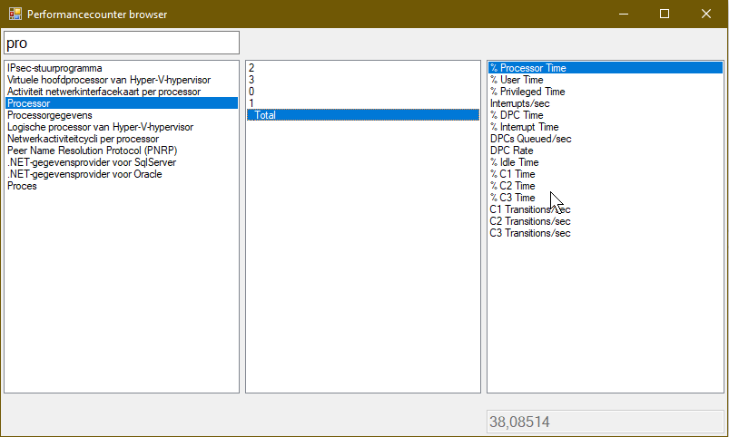

# PcBrowser
A simple windows tool to browser performance counters on your local system

Nothing more, nothing less. Browse the performance counters on your system, which may be hard to find on certain locales.
When selecting a performance counter you will also get a preview of the data.

